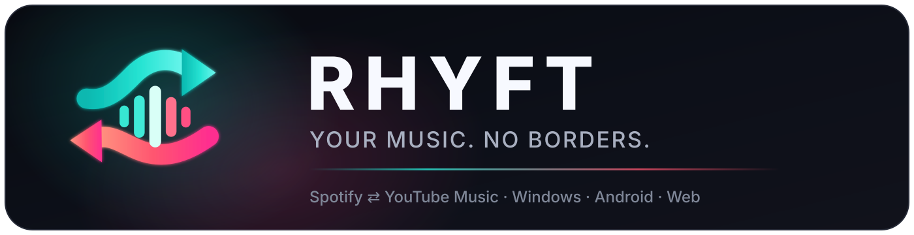
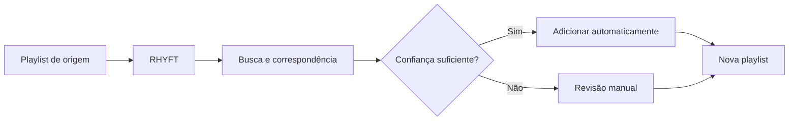

<div align="center">



Migre playlists entre **Spotify** e **YouTube Music** nos dois sentidos — pela Web, Windows ou Android.

[](https://migrador-playlists.netlify.app/)
[](https://migrador-playlists.netlify.app/migrar.html)
[](https://github.com/deadbynetsu/RHYFT/releases/latest/download/RHYFT.exe)
[](https://github.com/deadbynetsu/RHYFT/releases/latest/download/RHYFT-android.apk)

[](https://github.com/deadbynetsu/RHYFT/actions/workflows/build.yml)
[](https://github.com/deadbynetsu/RHYFT/actions/workflows/build-android.yml)
[](https://github.com/deadbynetsu/RHYFT/releases/latest)
[](./LICENSE)

**Windows · Android · Web · Gratuito · Open Source**

> Projeto independente. RHYFT não possui vínculo oficial com Spotify, Google, YouTube ou YouTube Music.

</div>

---

## O que é o RHYFT?

O **RHYFT** foi criado para tirar o atrito de mudar de plataforma de música. Ele lê uma playlist de origem, procura as faixas no serviço de destino e cria uma nova playlist para você.

Funciona nos dois sentidos:

- **Spotify → YouTube Music**
- **YouTube Music → Spotify**

Quando uma correspondência não é confiável, o RHYFT não escolhe no escuro: ele pode deixar a faixa para **revisão manual**.

---

## Plataformas

| Plataforma | Experiência | Acesso |
|---|---|---|
| 🌐 **Web** | Sem instalação, histórico salvo no navegador e revisão de faixas incertas | [Abrir RHYFT Online](https://migrador-playlists.netlify.app/migrar.html) |
| 🪟 **Windows** | App nativo em um único `RHYFT.exe`, progresso, pausa/retomada e histórico local | [Baixar RHYFT.exe](https://github.com/deadbynetsu/RHYFT/releases/latest/download/RHYFT.exe) |
| 🤖 **Android** | Interface mobile, autenticação de contas e migração direto pelo celular | [Baixar APK](https://github.com/deadbynetsu/RHYFT/releases/latest/download/RHYFT-android.apk) |

Os builds oficiais de Windows e Android são gerados pelo **GitHub Actions**. A publicação conjunta só ocorre após os testes e os dois builds passarem no mesmo commit. Releases já publicadas não são sobrescritas. Veja o [changelog](CHANGELOG.md) e as [notas da v1.5.0](releases/v1.5.0.md).

---

## Idiomas

Na primeira abertura dos apps Windows e Android, o RHYFT detecta o idioma do sistema e apresenta o seletor com esse idioma no topo. A escolha fica salva. Para mudar depois, use **Idioma** nas configurações e reabra o app.

O onboarding e os controles principais estão disponíveis em **Português (Brasil), English, Español, Français, Deutsch, Italiano, 日本語, 한국어, 简体中文 e 繁體中文**. Instruções avançadas e logs técnicos ainda podem usar o idioma original. [Como contribuir com traduções](LOCALIZATION.md).

## Principais recursos

- Migração **bidirecional** entre Spotify e YouTube Music
- Busca e correspondência automática de músicas
- Revisão manual para resultados incertos
- Progresso em tempo real
- Pausa, cancelamento e retomada nas versões nativas
- Histórico de migrações na Web
- OAuth nas integrações Web/mobile onde aplicável
- Downloads oficiais com **SHA-256**
- Atualizações automáticas dos artefatos na Release
- Código aberto sob licença MIT

---

## Como funciona



1. Conecte as contas necessárias.
2. Escolha o sentido da migração.
3. Cole o link ou ID da playlist.
4. Defina o nome da playlist de destino.
5. Inicie a migração.
6. Revise somente as faixas que realmente precisarem da sua escolha.

---

## Privacidade e segurança

O RHYFT não precisa da sua senha do Spotify ou Google. A autenticação usa os fluxos das próprias plataformas.

- Na **Web**, sessões ficam protegidas em cookies `HttpOnly` e os tokens não são expostos ao JavaScript da página.
- Nos **apps nativos**, configurações, tokens e progresso ficam no dispositivo do usuário.
- Credenciais privadas e arquivos locais de autenticação não são versionados no repositório.

[Política de Privacidade](https://migrador-playlists.netlify.app/privacidade.html) · [Termos de Serviço](https://migrador-playlists.netlify.app/termos.html)

---

## Windows e assinatura de código

Os binários de Windows passam por smoke test e verificação com **Microsoft Defender** durante o workflow de build.

O projeto também está em processo de solicitação de assinatura de código pela **SignPath Foundation**. Enquanto a assinatura oficial ainda não estiver ativa, versões baixadas fora da Microsoft Store podem exibir avisos de reputação do Windows.

**Free code signing provided by SignPath.io, certificate by SignPath Foundation.**

[Política de assinatura de código](./CODE_SIGNING.md)

---

## Stack

| Área | Tecnologias |
|---|---|
| Desktop | Python · CustomTkinter · Pillow · PyInstaller |
| Android | Python · Flet |
| Web | HTML · CSS · JavaScript · Netlify Functions |
| Integrações | Spotify Web API · YouTube Data API · ytmusicapi |
| CI/CD | GitHub Actions · Netlify |

---

## Estrutura do projeto

```text
RHYFT/
├── app.py                         # Interface principal do Windows
├── app_branded.py                 # Entrada de build com branding do Windows
├── nucleo.py                      # Lógica compartilhada dos apps nativos
├── assets/                        # Identidade visual oficial do RHYFT
├── celular/                       # Aplicativo Android em Flet
├── site/                          # Landing page e RHYFT Web
├── netlify/functions/api.js       # Backend/OAuth da versão Web
├── ferramentas/                   # Scripts auxiliares de build
└── .github/workflows/             # Builds automáticos de Windows e Android
```

---

## Rodar o app desktop pelo código-fonte

```bash
git clone https://github.com/deadbynetsu/RHYFT.git
cd RHYFT
pip install -r requirements.txt
python app.py
```

Para gerar o executável no Windows:

```bat
build.bat
```

---

## Downloads oficiais

Todos os downloads ficam em [**GitHub Releases**](https://github.com/deadbynetsu/RHYFT/releases/latest).

| Arquivo | Uso |
|---|---|
| `RHYFT.exe` | Executável único para Windows |
| `RHYFT-windows.zip` | Versão compactada do executável |
| `RHYFT-android.apk` | Aplicativo Android |
| `*.sha256` | Verificação de integridade dos downloads |

---

## Licença

Distribuído sob a licença **MIT**. Veja [LICENSE](./LICENSE).

<div align="center">

Feito por **[deadbynetsu](https://github.com/deadbynetsu)**

[Site](https://migrador-playlists.netlify.app/) · [Migrar online](https://migrador-playlists.netlify.app/migrar.html) · [Releases](https://github.com/deadbynetsu/RHYFT/releases/latest) · [Instagram](https://www.instagram.com/deadbynetsu.dev/) · [TikTok](https://www.tiktok.com/@deadbynetsu) · [YouTube](https://www.youtube.com/@DeadbyNeTsU)

</div>
